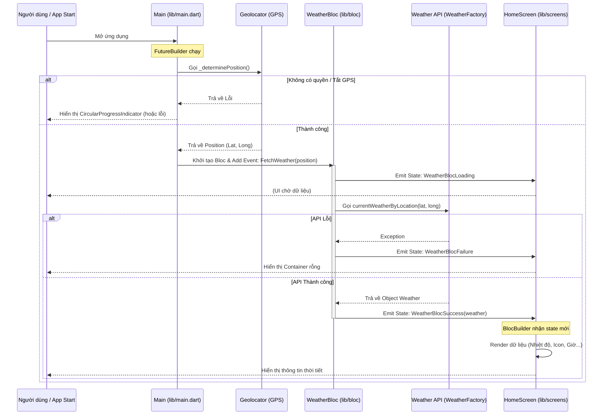

Dựa trên mã nguồn bạn cung cấp, ứng dụng này sử dụng kiến trúc **BLoC (Business Logic Component)** để quản lý trạng thái và luồng dữ liệu. Dưới đây là sơ đồ và giải thích chi tiết về cách dữ liệu di chuyển từ lúc khởi động ứng dụng đến khi hiển thị lên màn hình.

### Sơ đồ Luồng Dữ Liệu (Data Flow Chart)

Dưới đây là sơ đồ minh họa quy trình xử lý:



---

### Chi tiết từng bước trong code

#### 1. Khởi tạo & Lấy Vị trí (File: `lib/main.dart`)

* **Hành động:** Khi ứng dụng chạy (`MainApp`), `FutureBuilder` được gọi ngay lập tức.
* **Logic:** Hàm `_determinePosition()` được thực thi để kiểm tra quyền truy cập vị trí và bật GPS.
* **Dữ liệu:** Nếu thành công, nó trả về một đối tượng `Position` (chứa vĩ độ và kinh độ).

#### 2. Kích hoạt BLoC (File: `lib/main.dart` & `lib/bloc/weather_bloc_event.dart`)

* **Hành động:** Khi `FutureBuilder` có dữ liệu (`snap.hasData`), `BlocProvider` sẽ khởi tạo `WeatherBlocBloc`.
* **Truyền dữ liệu:** Ngay khi khởi tạo, nó gửi một sự kiện (Event) là `FetchWeather` vào BLoC, kèm theo dữ liệu `Position` vừa lấy được ở bước 1.
```dart
// Code snippet từ main.dart
..add(FetchWeather(snap.data as Position))

```


#### 3. Xử lý Logic Nghiệp vụ (File: `lib/bloc/weather_bloc_bloc.dart`)

* **Nhận sự kiện:** BLoC lắng nghe sự kiện `FetchWeather`.
* **Trạng thái Loading:** Đầu tiên, BLoC phát ra trạng thái `WeatherBlocLoading` để UI biết đang xử lý.
* **Gọi API:** BLoC sử dụng `WeatherFactory` (từ thư viện `weather`) và `API_KEY` (từ `lib/data/my_data.dart`) để gọi API lấy thời tiết dựa trên toạ độ từ sự kiện `FetchWeather`.
```dart
// Code snippet từ weather_bloc_bloc.dart
Weather weather = await wf.currentWeatherByLocation(...)

```


* **Kết quả:**
* Nếu thành công: Phát ra trạng thái `WeatherBlocSuccess` chứa đối tượng `Weather` (dữ liệu thời tiết đầy đủ).
* Nếu thất bại: Phát ra `WeatherBlocFailure`.


#### 4. Cập nhật Giao diện (File: `lib/screens/home_screen.dart`)

* **Lắng nghe:** Widget `BlocBuilder<WeatherBlocBloc, WeatherBlocState>` liên tục lắng nghe các thay đổi trạng thái từ BLoC.
* **Hiển thị:**
* Khi nhận được `WeatherBlocSuccess`, nó truy cập vào biến `state.weather`.
* Dữ liệu được bóc tách để hiển thị:
* `state.weather.areaName`: Tên thành phố/khu vực.
* `state.weather.temperature`: Nhiệt độ hiện tại.
* `state.weather.weatherConditionCode`: Mã thời tiết (dùng để chọn icon trong hàm `getWeatherIcon`).
* `state.weather.sunrise` / `sunset`: Giờ mặt trời mọc/lặn.


* **Chuyển đổi dữ liệu:** Các dữ liệu thô được format lại (ví dụ: làm tròn nhiệt độ, định dạng ngày giờ bằng `DateFormat`) để hiển thị đẹp mắt cho người dùng.

### Tóm tắt các luồng Object chính:

1. `Position` (Tọa độ): `Geolocator` -> `Main` -> `WeatherBloc` (qua Event).
2. `Weather` (Dữ liệu thời tiết): `API` -> `WeatherBloc` -> `WeatherBlocSuccess` (State) -> `HomeScreen` (UI).
