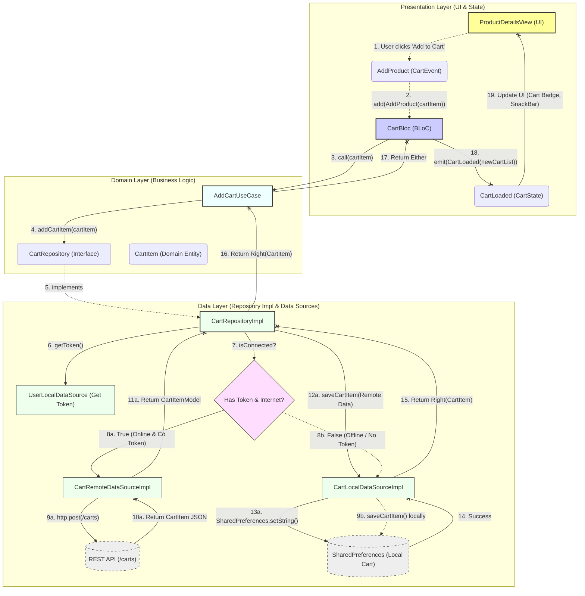

Để minh họa thêm về sức mạnh của Clean Architecture trong dự án này, tôi sẽ vẽ cho bạn một luồng dữ liệu (Data Flow) rất thú vị và phức tạp hơn một chút: **Luồng Thêm Sản Phẩm Vào Giỏ Hàng (Add To Cart Flow)**. 

Luồng này đặc biệt ở chỗ nó có xử lý **logic rẽ nhánh (Offline-first / Guest Mode)** ngay tại Data Layer: 
- Nếu người dùng chưa đăng nhập (không có token) hoặc mất mạng $\rightarrow$ Chỉ lưu giỏ hàng ở bộ nhớ tạm cục bộ (Local).
- Nếu người dùng đã đăng nhập và có mạng $\rightarrow$ Đẩy lên Server (API) rồi mới lưu vào bộ nhớ cục bộ.

Dưới đây là sơ đồ Mermaid mô tả chi tiết luồng này:

### 📝 Phân tích chi tiết các bước trong Data Flow:

**1. Hành động từ UI (Presentation Layer)**
* Người dùng ở màn hình `ProductDetailsView`, chọn Price Tag và bấm nút "Add to Cart".
* Nút này gọi sự kiện: `context.read<CartBloc>().add(AddProduct(cartItem: ...))`.
* `CartBloc` nhận Event `AddProduct`, lấy danh sách giỏ hàng hiện tại, sau đó gọi `_addCartUseCase(event.cartItem)`.

**2. Qua cầu nối nghiệp vụ (Domain Layer)**
* `AddCartUseCase` nhận tham số `CartItem`. Nó không quan tâm dữ liệu sẽ được lưu thế nào, nó chỉ đơn giản ra lệnh cho `CartRepository` thực thi hàm `addCartItem()`.

**3. Xử lý Logic thông minh tại Data Layer**
Tại `CartRepositoryImpl`, logic của Clean Architecture tỏa sáng:
* Nó gọi `UserLocalDataSource` để lấy Token (kiểm tra xem đã login chưa).
* Kiểm tra `NetworkInfo.isConnected` (xem có mạng không).
* **Rẽ nhánh 8a (Online & Authenticated):** Nếu có mạng VÀ có Token hợp lệ, nó gọi `CartRemoteDataSourceImpl` để bắn API `POST /carts`. Khi API lưu thành công trên Server và trả kết quả về, nó lấy Model đó đưa cho `CartLocalDataSource` để lưu tiếp vào Local (cho việc dùng offline).
* **Rẽ nhánh 8b (Guest Mode / Offline):** Nếu không có mạng HOẶC chưa đăng nhập (token rỗng), code bỏ qua việc gọi API, trực tiếp dùng `CartLocalDataSourceImpl` để lưu sản phẩm vào `SharedPreferences` (sẽ đồng bộ lên server ở lần đăng nhập tiếp theo).

**4. Luồng trả kết quả (Return Flow)**
* Dù rẽ vào nhánh nào, `CartRepositoryImpl` đều gom kết quả thành công vào `Right(CartItem)` (sử dụng thư viện Dartz).
* Kết quả truyền ngược lại qua `AddCartUseCase` về `CartBloc`.
* `CartBloc` gộp `CartItem` mới vào mảng `cart` hiện tại và emit ra State `CartLoaded(cart: newCartList)`.
* Giao diện nhận thấy sự thay đổi State sẽ update UI (Ví dụ: Số lượng badge trên giỏ hàng ở thanh Navigation tăng lên).
