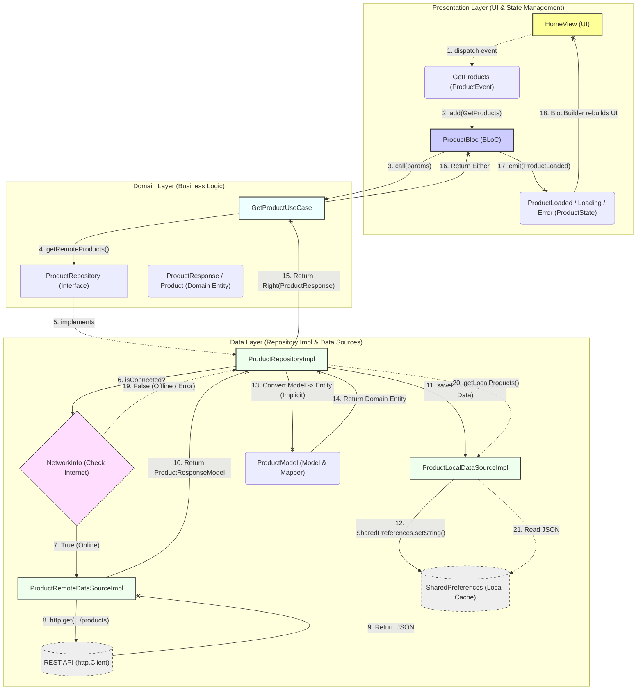

Dựa trên source code của dự án **Flutter-TDD-Clean-Architecture-E-Commerce-App** mà bạn cung cấp, kiến trúc được sử dụng là Clean Architecture kết hợp với BLoC làm State Management. 

Để minh họa rõ nhất luồng dữ liệu (Data Flow), tôi sẽ lấy ví dụ về **Luồng lấy danh sách sản phẩm (Get Products Flow)** (từ `HomeView` -> `ProductBloc` -> `GetProductUseCase` -> API/Cache), vì đây là luồng cốt lõi và thể hiện đầy đủ nhất các thành phần của kiến trúc này.

Dưới đây là sơ đồ Mermaid mô tả chính xác Data Flow của dự án:

### Giải thích chi tiết các bước trong Flow:

**1. Presentation Layer (Luồng yêu cầu):**
* `HomeView` sử dụng `BlocBuilder`. Khi user mở app hoặc pull-to-refresh, UI gọi `context.read<ProductBloc>().add(GetProducts(...))`.
* `ProductBloc` nhận Event, lập tức emit state `ProductLoading` ra UI và gọi hàm thực thi của UseCase.

**2. Domain Layer (Xử lý logic nghiệp vụ):**
* `GetProductUseCase` nhận `FilterProductParams` (keyword, category, minPrice...). Nó đóng vai trò cầu nối, gọi hàm `getRemoteProducts()` từ interface `ProductRepository`.
* Domain Layer hoàn toàn **không biết** dữ liệu lấy từ API hay Database cục bộ.

**3. Data Layer (Lấy dữ liệu và Caching):**
* `ProductRepositoryImpl` (được tiêm qua Dependency Injection - `get_it`) thực thi gọi dữ liệu.
* Bước đầu tiên nó làm là dùng `NetworkInfo` kiểm tra xem thiết bị có internet không.
* **Nếu có mạng (Online):** * Gọi `ProductRemoteDataSourceImpl` để bắn request HTTP GET tới REST API bằng `http.Client`.
  * Khi API trả về JSON, RemoteDataSource map nó thành `ProductResponseModel`.
  * Gửi trả Model về cho `ProductRepositoryImpl`.
  * `ProductRepositoryImpl` sẽ gọi `ProductLocalDataSourceImpl` để lưu (cache) đoạn dữ liệu này vào `SharedPreferences` cho các lần dùng offline sau này.
* **Nếu mất mạng (Offline / Error):** * (Trong một số context như get local/cart/categories, flow sẽ chẽ nhánh lấy dữ liệu cache từ `SharedPreferences`).

**4. Luồng trả về (Return Flow lên UI):**
* Dữ liệu nhận được là các Model (nằm ở lớp Data), nó sẽ được ngầm định coi như là Entity (do `ProductModel extends Product`) hoặc được map sang Domain Entity (`Product`).
* Repository bọc dữ liệu thành công trong đối tượng `Right` của package `dartz` (Ví dụ: `Right(ProductResponse)`). Nếu lỗi sẽ bọc trong `Left(Failure)`.
* Trả ngược kết quả về `ProductBloc`.
* `ProductBloc` kiểm tra kết quả (fold Either), emit ra `ProductLoaded` kèm theo danh sách sản phẩm.
* `BlocBuilder` trên `HomeView` nhận State mới và tiến hành Rebuild lại UI, vẽ các `ProductCard` ra màn hình.
