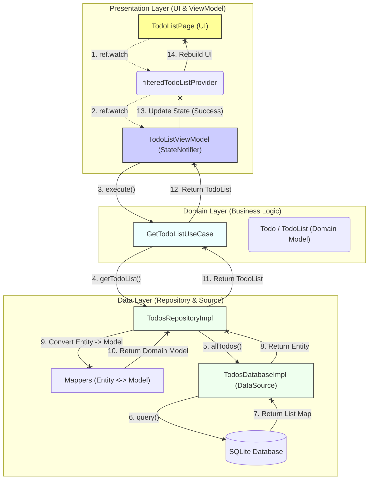

Dựa trên source code bạn cung cấp, ứng dụng này được xây dựng theo kiến trúc **Clean Architecture** kết hợp với **Riverpod** để quản lý trạng thái.

Dưới đây là sơ đồ luồng dữ liệu (Data Flow) chi tiết từ lúc khởi tạo giao diện cho đến khi lấy được dữ liệu từ Database.

### Sơ đồ Luồng Dữ Liệu (Mermaid Graph)

---

### Giải thích chi tiết từng bước

Dưới đây là diễn giải chi tiết dựa trên các file code thực tế bạn đã upload:

#### 1. Presentation Layer (Giao diện)

* **Bước 1 & 2:** Tại `TodoListPage`, Widget lắng nghe `filteredTodoListProvider`. Provider này lại lắng nghe `todoListViewModelStateNotifierProvider` để lấy dữ liệu gốc.
* **Khởi tạo:** Khi `TodoListViewModel` được khởi tạo, nó tự động gọi hàm `_getTodoList()` trong constructor để bắt đầu tải dữ liệu.

#### 2. Domain Layer (Nghiệp vụ)

* **Bước 3:** `TodoListViewModel` gọi `_getTodoListUseCase.execute()`.
* **Bước 4:** `GetTodoListUseCaseImpl` (lớp triển khai của UseCase) gọi xuống Repository qua hàm `_repository.getTodoList()`.
* *Lưu ý:* Ở tầng này, code chỉ biết đến Interface `TodosRepository` chứ không biết chi tiết triển khai bên dưới (Dependency Inversion).

#### 3. Data Layer (Dữ liệu)

* **Bước 5:** `TodosRepositoryImpl` nhận lệnh và gọi `database.allTodos()` từ DataSource.
* **Bước 6 & 7:** `TodosDatabaseImpl` thực hiện câu lệnh SQL `db.query(...)` trực tiếp vào SQLite và nhận về một danh sách các Map (JSON).
* **Bước 8:** DataSource trả về `TodoListEntity` (bản chất là List<Map>) cho Repository.

#### 4. Mapping & Trả về (Chuyển đổi dữ liệu)

* **Bước 9 & 10:** Tại `TodosRepositoryImpl`, dữ liệu thô (Entity) được đưa qua `TodoListMapper` để chuyển thành `TodoList` (Domain Model). Đây là bước quan trọng để tách biệt dữ liệu DB và dữ liệu dùng trong App.
* **Bước 11 & 12:** Dữ liệu sạch (`TodoList`) được trả ngược lên UseCase và về tới ViewModel.

#### 5. Cập nhật UI

* **Bước 13:** `TodoListViewModel` cập nhật `state` thành `State.success(todoList)`.
* **Bước 14:** `filteredTodoListProvider` nhận thấy state thay đổi, nó lọc dữ liệu (theo All/Completed/Incomplete) và báo cho `TodoListPage` vẽ lại giao diện (Rebuild).

### Luồng Ghi Dữ liệu (Ví dụ: Thêm Todo mới)

Khi người dùng thêm Todo:

1. **UI** gọi `ViewModel.addTodo(...)`.
2. **ViewModel** gọi `CreateTodoUseCase`.
3. **UseCase** gọi `Repository.createTodo`.
4. **Repository** dùng Mapper chuyển Model -> Entity (Map) rồi gọi `database.insertTodo`.
5. **Database** lưu vào SQLite.
6. Sau khi lưu xong, ViewModel cập nhật lại state cục bộ bằng cách thêm item mới vào list hiện có (`state.data!.addTodo(newTodo)`) để UI cập nhật ngay lập tức mà không cần load lại toàn bộ DB.
