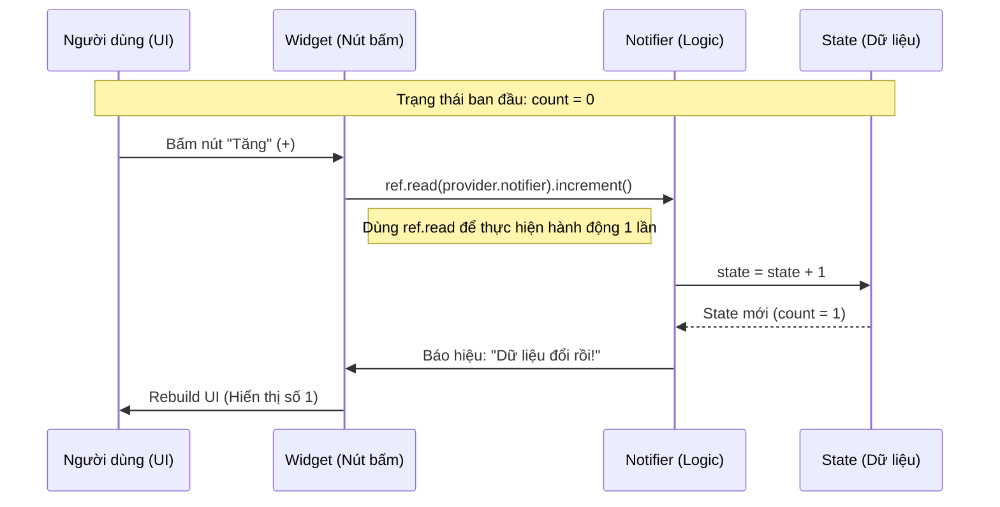

Chào bạn, yêu cầu của bạn rất thiết thực. Hiểu được luồng dữ liệu (Data Flow) là chìa khóa để làm chủ Riverpod.

Riverpod tuân theo nguyên tắc **Uni-directional Data Flow (Luồng dữ liệu một chiều)**. Điều này có nghĩa là dữ liệu luôn di chuyển theo một vòng tròn khép kín dễ đoán, không chạy lung tung.

Hãy tưởng tượng Riverpod như một "Trung tâm chỉ huy".

* **State (Trạng thái):** Là dữ liệu hiện tại (ví dụ: danh sách sản phẩm, thông tin user đang đăng nhập).
* **Provider/Notifier:** Là người giữ kho và quản lý kho.
* **UI (Widget):** Là cái màn hình hiển thị những gì có trong kho.

Dưới đây là các sơ đồ minh họa luồng dữ liệu từ đơn giản đến phức tạp.

---

### 1. Bức tranh toàn cảnh (The Big Picture)

Đây là vòng đời cơ bản nhất của dữ liệu trong Riverpod.

```mermaid
graph TD
    A[State / Dữ liệu] -->|được giữ bởi| B(Provider / Notifier);
    B -->|ref.watch| C{Consumer Widget / UI};
    C -->|Hiển thị| D[Màn hình người dùng];
    D -->|Tương tác người dùng (Bấm nút)| E[Hành động / Sự kiện];
    E -->|ref.read(...).notifier.method()| B;
    B -->|Cập nhật lại| A;

    style A fill:#f9f,stroke:#333,stroke-width:2px,color:black
    style B fill:#ccf,stroke:#333,stroke-width:2px,color:black
    style C fill:#ff9,stroke:#333,stroke-width:2px,color:black
    style E fill:#cfc,stroke:#333,stroke-width:2px,color:black

```

**Giải thích:**

1. **State** nằm trong **Provider**.
2. **UI (Widget)** "đăng ký theo dõi" (`ref.watch`) cái State đó. Hễ State thay đổi, UI tự vẽ lại.
3. Người dùng bấm nút trên UI.
4. Hành động bấm nút gọi một hàm trong Notifier (`ref.read(provider.notifier).doSomething()`) để yêu cầu thay đổi State.
5. Notifier tính toán và cập nhật State mới. Vòng lặp quay lại bước 2.

---

### 2. Luồng chi tiết 1: Đọc dữ liệu (Read Flow)

Đây là luồng thụ động, khi UI chỉ hiển thị dữ liệu đang có.

**(Sơ đồ text minh họa)**

```
[KHO CHỨA DATA (StateNotifier/AsyncNotifier)]
      │
      │ (Giữ State hiện tại: ví dụ count = 5)
      │
[PROVIDER] 📢 (Loa phát thanh)
      │
      │ 👂 ref.watch(provider) (Lắng nghe liên tục)
      │
      ▼
[WIDGET / UI] 🖼️ (Màn hình)
(Vẽ lên màn hình số "5")

```

**Quy tắc vàng:**

* Trong hàm `build()` của Widget, **LUÔN LUÔN** dùng `ref.watch` để lắng nghe giá trị. Điều này đảm bảo khi dữ liệu thay đổi, widget sẽ được build lại.

---

### 3. Luồng chi tiết 2: Ghi/Sửa đổi dữ liệu đồng bộ (Sync Write Flow)

Ví dụ: Ứng dụng đếm số (Counter App), tăng giảm số lượng trong giỏ hàng. Mọi thứ diễn ra ngay lập tức trong bộ nhớ.



---

### 4. Luồng chi tiết 3: Xử lý bất đồng bộ (Async Flow - API/Database)

Đây là luồng quan trọng và mạnh mẽ nhất của Riverpod 2.0+, sử dụng `AsyncValue` (Loading / Data / Error).

Ví dụ: Bấm nút đăng nhập, gọi API, chờ kết quả.

```mermaid
graph TD
    User[Người dùng bấm nút 'Đăng nhập'] -->|1. Gọi hàm| UIAction[UI: ref.read(...).login()];
    UIAction -->|2. Kích hoạt| Notifier[Notifier (AsyncNotifier)];
    
    Notifier --x|3. SET STATE: Loading| AsyncLoading[AsyncValue.loading ⏳];
    AsyncLoading -.->|Báo hiệu UI| UIRebuild1[UI vẽ vòng quay loading];

    Notifier -->|4. Gọi Repository| Repo[Repository / Data Layer];
    Repo -->|5. Gọi Server API| API[Server API ☁️];
    
    API --x|6a. Trả về thành công (Data)| Repo;
    Repo --x|7a. Trả về Data| Notifier;
    Notifier --x|8a. SET STATE: Data| AsyncData[AsyncValue.data ✅];
    AsyncData -.->|Báo hiệu UI| UIRebuild2a[UI chuyển sang màn hình chính];

    API --x|6b. Trả về lỗi (Error)| Repo;
    Repo --x|7b. Trả về Exception| Notifier;
    Notifier --x|8b. SET STATE: Error| AsyncError[AsyncValue.error ❌];
    AsyncError -.->|Báo hiệu UI| UIRebuild2b[UI hiện thông báo lỗi];

    style AsyncLoading fill:#eee,stroke:gray,stroke-dasharray: 5 5
    style AsyncData fill:#dfd,stroke:green
    style AsyncError fill:#fdd,stroke:red

```

**Điểm mấu chốt của luồng Async:**

1. UI gọi hành động.
2. Notifier ngay lập tức đặt state là `Loading` -> UI hiện vòng quay.
3. Sau khi có kết quả từ API, Notifier cập nhật state là `Data` (nếu thành công) hoặc `Error` (nếu thất bại).
4. UI tự động chuyển đổi giao diện dựa trên trạng thái cuối cùng nhờ `.when()`.

---

### 5. Tổng kết các quy tắc về luồng dữ liệu

Để luồng dữ liệu luôn trơn tru, hãy nhớ kỹ các nguyên tắc này khi code:

1. **Dữ liệu đi xuống (Data Down):** Từ Provider xuống Widget thông qua `ref.watch`.
2. **Hành động đi lên (Action Up):** Từ Widget lên Provider thông qua `ref.read(...).notifier.method()`.
3. **Tuyệt đối không sửa State trực tiếp trong Widget:** Widget chỉ được phép gọi hàm của Notifier, Notifier là nơi duy nhất được quyền sửa State (`state = ...`).
4. **Tách biệt UI và Logic:** Widget chỉ nên chứa code vẽ giao diện. Logic gọi API, tính toán nên nằm trong Notifier.
