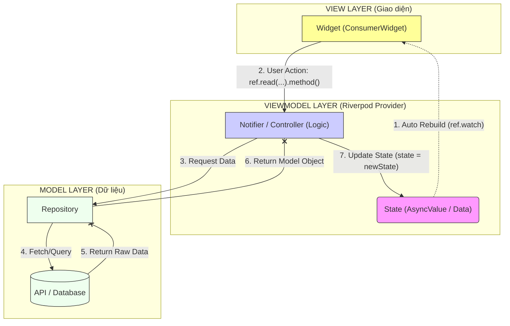

Chào bạn, đây là sơ đồ luồng dữ liệu (Data Flow) khi áp dụng kiến trúc **MVVM (Model - View - ViewModel)** kết hợp với **Riverpod**.

Trong Riverpod:

* **View** = `ConsumerWidget` / `ConsumerStatefulWidget`.
* **ViewModel** = `Notifier` / `AsyncNotifier` (Class logic nằm trong Provider).
* **Model** = Data Class (User, Product...) + Repository.

Dưới đây là sơ đồ chi tiết được tối ưu cú pháp để không bị lỗi:

### Giải thích chi tiết từng bước trong MVVM Riverpod:

1. **View (UI):**
* Nhiệm vụ: Chỉ hiển thị dữ liệu và nhận tương tác.
* Kết nối: Sử dụng **`ref.watch(provider)`** để lắng nghe `State`. Khi `State` thay đổi, View tự động vẽ lại.
* Hành động: Khi người dùng bấm nút, View dùng **`ref.read(provider.notifier).method()`** để yêu cầu ViewModel làm việc.

2. **ViewModel (Notifier):**
* Nhiệm vụ: Chứa business logic, trạng thái loading/error, và chuyển đổi dữ liệu thô thành dữ liệu hiển thị.
* Trong Riverpod, đây chính là class kế thừa `AsyncNotifier` hoặc `Notifier`.
* Kết nối: Gọi xuống `Repository` để lấy dữ liệu. Sau khi có dữ liệu, nó gán **`state = ...`** để cập nhật trạng thái mới.

3. **Model (Repository & Data):**
* Nhiệm vụ: Làm việc trực tiếp với API, Database. Nó không biết gì về UI hay Riverpod.
* Nó trả về các Object (Model) thuần túy (như `User`, `Product`) cho ViewModel.

### Mẹo nhỏ:

Trong sơ đồ trên, mũi tên nét đứt (`-.->`) biểu thị luồng **Reactive** (Tự động cập nhật), còn mũi tên nét liền (`-->`) biểu thị luồng **Imperative** (Gọi hàm chủ động). Đây là đặc trưng của Riverpod: **Dữ liệu đi xuống (qua watch), Hành động đi lên (qua read).**
