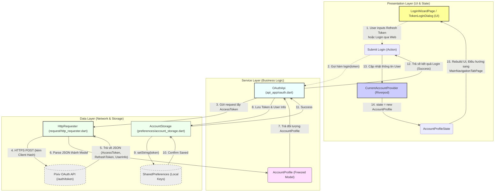

Dựa vào cấu trúc mã nguồn của dự án **Pixiv Artvier** mà bạn đã cung cấp (đặc biệt là các tệp trong `pages/login`, `api_app/oauth.dart`, `global/provider/current_account_provider.dart` và `preferences/account_storage.dart`), tôi đã điều chỉnh sơ đồ luồng dữ liệu (Data Flow) cho phù hợp với kiến trúc thực tế của ứng dụng này. 

Dự án này sử dụng mô hình **Riverpod** (quản lý state) kết hợp với cấu trúc phân lớp chức năng rõ ràng. Dưới đây là sơ đồ luồng đăng nhập (đặc biệt là qua Refresh Token hoặc Web Login):

### Giải thích ánh xạ với Source Code của bạn:
1. **Lớp Presentation**: Giao diện (ví dụ `login_wizard_page.dart` hoặc `token_login.dart`) nhận tương tác của người dùng. Trạng thái sau khi đăng nhập được quản lý bởi `current_account_provider.dart` (biến toàn cục lưu trữ người dùng hiện tại).
2. **Lớp Service (Domain)**: Thay vì BLoC/UseCase, project này gọi thẳng các API thông qua file `oauth.dart` nằm trong `api_app`. Dữ liệu trả về sẽ được map vào model có sẵn như `account_profile.dart`.
3. **Lớp Data**: Tầng mạng gọi qua file `http_requester.dart` (cấu hình sẵn interceptors), và dữ liệu sau khi nhận về (AccessToken, RefreshToken) sẽ được lưu xuống ổ cứng nội bộ thông qua `account_storage.dart` (sử dụng Shared Preferences).
